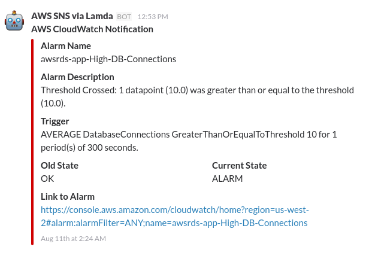
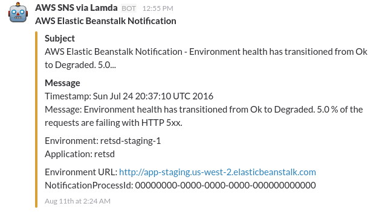

# lambda-cloudwatch-slack

An [AWS Lambda](http://aws.amazon.com/lambda/) function for better Slack notifications.

[](https://travis-ci.org/assertible/lambda-cloudwatch-slack)
[](http://badge.fury.io/js/lambda-cloudwatch-slack)


## Overview

This function was originally derived from the AWS blueprint named `cloudwatch-alarm-to-slack`.
The function in this repo improves on the default blueprint in several ways:

1. Better default formatting

    [](https://assertible.com)

2. Basic support for notifications from Elastic Beanstalk

    [](https://assertible.com)

## Testing

```
make test
```

## Configuration

Follow these steps to configure the webhook in Slack:

  1. Navigate to https://<your-team-domain>.slack.com/services/new

  2. Search for and select "Incoming WebHooks".

  3. Choose the default channel where messages will be sent and click "Add Incoming WebHooks Integration".

  4. Copy the webhook URL from the setup instructions and use it in the next section.


### Unencrypted hook URL

Un-encrypted Slack webhook URL's are not currently supported (coming-soon).

### Encrypted hook URL

Follow these steps to encrypt your Slack hook URL for use in this function:

  1. Create a KMS key - http://docs.aws.amazon.com/kms/latest/developerguide/create-keys.html.

  2. Encrypt the event collector token using the AWS CLI.
     $ aws kms encrypt --key-id alias/<KMS key name> --plaintext "<SLACK_HOOK_URL>"

     Note: You must exclude the protocol from the URL (e.g. "hooks.slack.com/services/abc123").

  3. Copy the base-64 encoded, encrypted key (CiphertextBlob) to the ENCRYPTED_HOOK_URL variable.

  4. Give your function's role permission for the kms:Decrypt action.
     Example:

```
{
    "Version": "2012-10-17",
    "Statement": [
        {
            "Sid": "Stmt1443036478000",
            "Effect": "Allow",
            "Action": [
                "kms:Decrypt"
            ],
            "Resource": [
                "<your KMS key ARN>"
            ]
        }
    ]
}
```
